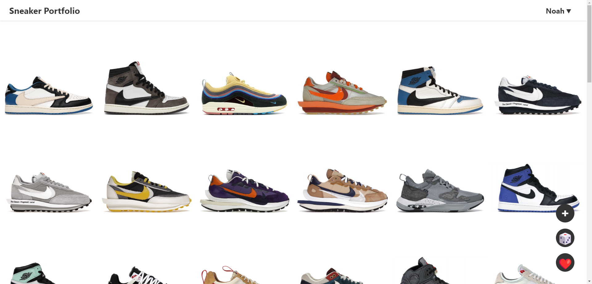

### sneaker-portfolio
- `docker-compose up`

### sneaker-server
- `poetry run uvicorn api.main:app` to run Backend

### sneaker-fronted
- `npm install`
- `npm run build` for building static website for FastAPI
- `npm start`

# Sneaker Portfolio  [Website](nsli.me)

## Features

    
 Visual Portfolio

      
     </img>

    
 360 Degree Animations

      
     </img>

    
Drag & Drop 

      
     </img>

    
Get Shoe Information & Links

      
     </img>

    
Add Shoes

      
     </img>

    
Remove Shoes

      
     </img>

    
Get Random Shoe 🎲

      
     </img>

    
Favorite View ❤️

      
     </img>

 

