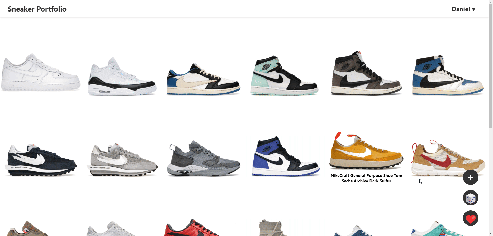

### sneaker-portfolio
- `docker-compose up`

### sneaker-server
- `poetry run uvicorn api.main:app` to run Backend

### sneaker-fronted
- `npm install`
- `npm run build` for building static website for FastAPI
- `npm start`

# Sneaker Portfolio  [Website](nsli.me)

## Features

### Track your collection

Track your shoe collection and order it in any way you want using drag & drop. On hover, a 360 degree animation of each shoe is displayed.

GIF

  
 </img>

### Get information about any shoe

If you click on any shoe in your portfolion, you can look at further information, such as a small description and a link to StockX.

### Search for and add shoes
With the Add button, you can search for any shoe. After finding the right one, you can add it to your portfolio. 

### Get a random shoe from your collection

If you are ever unsure what shoe to wear, you can simply use the 🎲 button and let the portfolio pick a random shoe from your collection.

### Favourite your shoes

When hovering over a shoe and clicking on the ❤️, you can favourite or un-favourite any shoe in your portfolio. After clicking on the ❤️ button, only the favourited shoes will be presented, while the other ones will be greyed out. If the 🎲 button is pressed in this mode, you will only get random suggestions from your favourite shoes.

