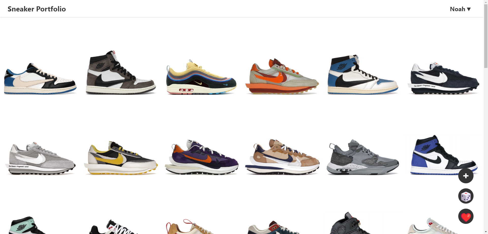

# Sneaker Portfolio  [Website](https://nsli.me)

  
- [Sneaker Portfolio  Website](#sneaker-portfolio--website)
  - [Features](#features)
  - [How to use?](#how-to-use)
    - [Backend](#backend)
    - [Frontend](#frontend)
    - [Docker 🐳](#docker-)
  - [Future features](#future-features)

## Features

    
 Visual Portfolio

      
     </img>

    
 360 Degree Animations

      
     </img>

    
Drag & Drop 

      
     </img>

    
Get Shoe Information & Links

      
     </img>

    
Add Shoes

      
     </img>

    
Remove Shoes

      
     </img>

    
Get Random Shoe 🎲

      
     </img>

    
Favorite View ❤️

      
     </img>

 

## How to use?

The portfolio consists of a FastAPI Backend and a Frontend written in React. For the application to be working, both of the services have to be running. 

**BEFORE YOU START THE APPLICATION:**

- Add a `.env` file in `/sneaker-frontend` similar to the `.env.template` found in the same folder. 
- The variable `REACT_APP_API_URL` should be configured the URL the application is running on. If you are running it on your local machine, use `http://localhost:8000/` as the value.

### Backend

- `make install-server` to install dependencies
- `make server` to start the server on port `8000`

### Frontend

- `make build` to install dependencies and generate static webpages. The frontend will also be accessible through port `8000
- `make frontend` for development of the website on port `3000`.

### Docker 🐳

- The application can also be run through docker. Simply run `docker-compose up` to start both front- and backend.

## Future features

- Allow addition of users
- ...