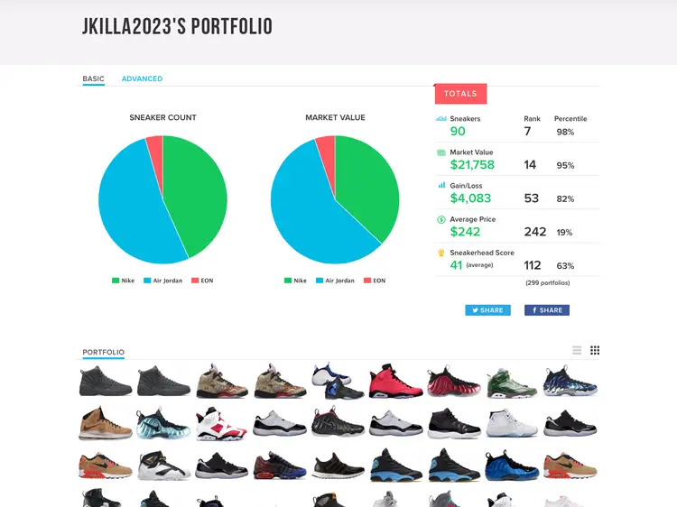

# Sneaker Portfolio  👟 

### [Website](https://nsli.me) <-- Check it out

 </img>

## Table of Contents

- [Motivation](#motivation)
- [Feature Showcase](#feature-showcase)
- [How to use?](#how-to-use)
  - [Requirements](#requirements)
  - [Step by Step Tutorial](#step-by-step-tutorial)
  - [Commands](#commands)
    - [Backend](#backend)
    - [Frontend](#frontend)
- [Docker 🐳](#docker-)
- [Future features](#future-features)

## Motivation

Back in the day, [StockX](https://stockx.com/) used to have a feature where you could create a shoe portfolio with which one could track every shoe purchased or sold. While this could be used to show off the value of ones collection, it also made for a nice overview of the shoes in a collection. It looked like this:

  

One can see all the shoes in the collection visually, and gain some information about the market value, amount of sneakers, and other information. This feature does not exist on StockX anymore. For this reason, we decided to create a Sneaker Portfolio ourselves, with which we could track the shoes we purchase in a digital form. Contrary to StockX, we won't be focussing on resell value, but rather a better visual representation of the shoe collection.

## Feature Showcase

*[CLICK TO EXPAND]*

    
 360 Degree Animations

      
     </img>

    
Drag & Drop 

      
     </img>

    
Get Shoe Information & Links

      
     </img>

    
Add Shoes

      
     </img>

    
Remove Shoes

      
     </img>

    
Get Random Shoe 🎲

      
     </img>

    
Favorite View ❤️

      
     </img>

## How to use?

**BEFORE YOU START THE APPLICATION:**

- The variable `REACT_APP_API_URL` has to be configured to the URL the application will be running on. If you run it on your local machine, it has to be configured to `http://localhost:8000/`.
- To configure the variable, add a `.env` file in `sneaker-frontend` similar to the `.env.template` found in the same folder 

### Requirements
For the application to run on your device, you will need some things installed. The linked tutorials and commands are written for an Ubuntu Linux distribution. To make the Python environment easier to setup, [conda](https://docs.conda.io/en/latest/) is recommended.

- `Python 3.11` --> [Tutorial](https://iohk.zendesk.com/hc/en-us/articles/16724475448473-Install-Python-3-11-on-ubuntu)
- `pip` --> `sudo apt install python3-pip`
- `poetry` --> `pip install poetry`
- `nodejs` --> `sudo apt install nodejs`
- `npm` -->  `sudo apt install npm`

### Step by Step Tutorial

To run the application, execute the following commands:
1. `make install-server` 
1. `make build`
1. `make server`

### Commands
#### Backend

- `make install-server` to install dependencies.
- `make server` to start the Python FastAPI backend server on default port `8000`.

#### Frontend

- `make build` to install dependencies and generate static webpages with React. These webpages can then be served by the backend. 
- `make frontend` starts a webserver serving the websites on default port `3000`.

### Docker 🐳

- The application can also be run through docker. Simply run `docker-compose up` to start both front- and backend.

## Further documentation

- [API endpoints](api-endpoints.md)
## Future features

- Creation of new users via the Frotnend. Currently, there is a fix amount of users added by hand to the database.
- Insertion of custom entries, in case StockX does not have a shoe available.
- ...